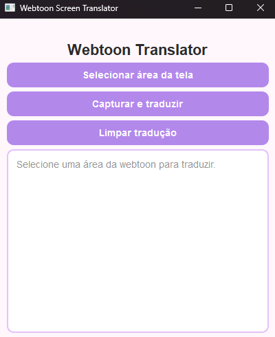
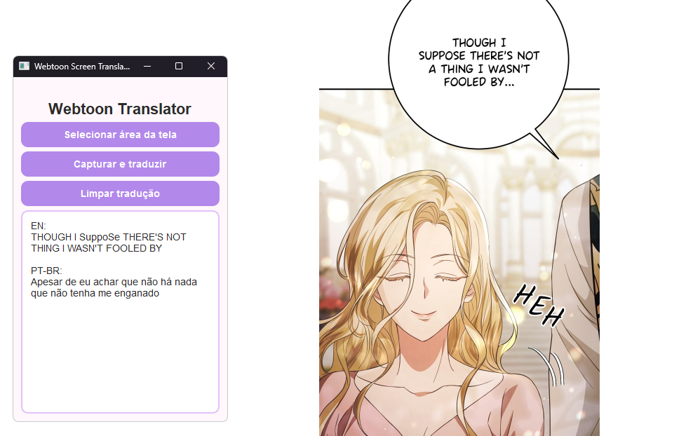

# Webtoon Translator

Aplicativo desktop desenvolvido em Python para traduzir textos de webtoons diretamente da tela utilizando OCR e a API do DeepL.

## Funcionalidades

- Seleção de área da tela
- Reconhecimento de texto com EasyOCR
- Tradução automática utilizando DeepL
- Interface gráfica desenvolvida com PySide6
- Limpeza rápida das traduções

## Tecnologias Utilizadas

- Python
- PySide6
- EasyOCR
- DeepL API
- OpenCV
- MSS
- NumPy

## Demonstração

### Tela Principal




### Seleção da Área


### Tradução




---

## Como Executar

### 1. Clone o repositório

```terminal
git clone https://github.com/lunayrapaixao00-sketch/webtoon-translator.git
```

### 2. Entre na pasta

```terminal
cd webtoon-translator
```

### 3. Instale as dependências

```terminal
pip install -r requirements.txt
```

### 4. Configure a chave da DeepL

Crie um arquivo `.env` na raiz do projeto:

```env
DEEPL_API_KEY=SUA_CHAVE_AQUI
```

### 5. Execute

```terminal
python main.py
```

---

## Estrutura do Projeto

```text
webtoon-translator/
│
├── assets/
│   └── logo.png
│
├── screenshots/
│
├── main.py
├── requirements.txt
├── .gitignore
├── README.md
└── .env.example
```

---

## Objetivo

Este projeto foi desenvolvido com o objetivo de facilitar a leitura de webtoons em outros idiomas, permitindo que o usuário selecione uma área da tela, extraia o texto por OCR e obtenha a tradução de forma rápida e prática.

---

## Autora

**Lunayra Paixão**

Estudante de Análise e Desenvolvimento de Sistemas.

GitHub: https://github.com/lunayrapaixao00-sketch
